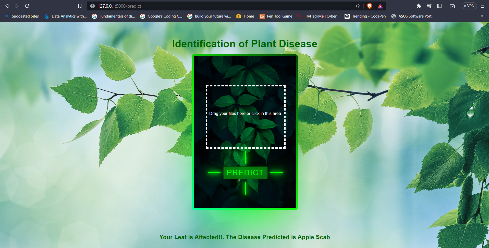

# Identification-of-Plant-Disease-using-Deep-Learning-Mini-Project-


## Python Flask Program
```python

from flask import Flask, render_template, url_for, request
import torch
import torch.nn as nn           # for creating  neural networks
from torch.utils.data import DataLoader
import torch.nn.functional as F # for functions for calculating loss
import torchvision.transforms as transforms   # for transforming images into tensors 
from torchvision.utils import make_grid       # for data checking
from torchvision.datasets import ImageFolder  # for working with classes and images
from torchsummary import summary 
from PIL import Image
from torchvision.models.segmentation import deeplabv3_resnet50

#import torchvision.transforms as transforms    
#from torchvision.utils import make_grid       
#from torchvision.datasets import ImageFolder

app = Flask(__name__)

"""def get_default_device():
    if torch.cuda.is_available():       
        return torch.device('cuda')
    else:
        return torch.device('cpu')"""

def to_device(data, device):
    """Move tensor(s) to chosen device"""
    if isinstance(data, (list,tuple)):
        return [to_device(x, device) for x in data]
    return data.to(device, non_blocking=True)

class DeviceDataLoader():
    """Wrap a dataloader to move data to a device"""
    def __init__(self, dl, device):
        self.dl = dl
        self.device = device
        
    def __iter__(self):
        """Yield a batch of data after moving it to device"""
        for b in self.dl:
            yield to_device(b, self.device)
        
    def __len__(self):
        """Number of batches"""
        return len(self.dl)

device = torch.device('cpu')

disease_class = ['Apple Scab', 'Apple Black Rot', 'Apple Cedar Rust', 'Apple Healthy',
                 'Blueberry Healthy', 'Cherry Powdery Mildew', 'Cherry Healthy', 'Corn Cercospora Gray Spot',
                 'Corn Common Rust', 'Corn Northern Leaf Blight', 'Corn Healthy', 'Grape Black Rot',
                 'Grape Esca Black Measles', 'Grape Leaf Blight(Isariopsis Leaf Spot)',
                 'Grape Healthy', 'Orange Haunglongbing(Citrus Greening)', 'Peach Bacterial Spot',
                 'Peach Healthy', 'Pepper Bell Bacterial Spot', 'Pepper Bell Healthy',
                 'Potato Early Blight', 'Potato Late Blight', 'Potato Healthy', 'Raspberry Healthy',
                 'Soybean Healthy', 'Squash Powdery Mildew', 'Strawberry Leaf Scorch', 'Strawberry Healthy',
                 'Tomato Bacterial Spot', 'Tomato Early Blight', 'Tomato Late Blight', 'Tomato Leaf Mold',
                 'Tomato Septoria Leaf Spot', 'Tomato Spider Mites (Two Spotted)', 'Tomato Target Spot',
                 'Tomato Yellow Leaf Curl Virus', 'Tomato Mosaic Virus', 'Tomato Healthy']

class SimpleResidualBlock(nn.Module):
    def __init__(self):
        super().__init__()
        self.conv1 = nn.Conv2d(in_channels=3, out_channels=3, kernel_size=3, stride=1, padding=1)
        self.relu1 = nn.ReLU()
        self.conv2 = nn.Conv2d(in_channels=3, out_channels=3, kernel_size=3, stride=1, padding=1)
        self.relu2 = nn.ReLU()
        
    def forward(self, x):
        out = self.conv1(x)
        out = self.relu1(out)
        out = self.conv2(out)
        return self.relu2(out) + x # ReLU can be applied before or after adding the input
def accuracy(outputs, labels):
    _, preds = torch.max(outputs, dim=1)
    return torch.tensor(torch.sum(preds == labels).item() / len(preds))


# base class for the model
class ImageClassificationBase(nn.Module):
    
    def training_step(self, batch):
        images, labels = batch
        out = self(images)                  # Generate predictions
        loss = F.cross_entropy(out, labels) # Calculate loss
        return loss
    
    def validation_step(self, batch):
        images, labels = batch
        out = self(images)                   # Generate prediction
        loss = F.cross_entropy(out, labels)  # Calculate loss
        acc = accuracy(out, labels)          # Calculate accuracy
        return {"val_loss": loss.detach(), "val_accuracy": acc}
    
    def validation_epoch_end(self, outputs):
        batch_losses = [x["val_loss"] for x in outputs]
        batch_accuracy = [x["val_accuracy"] for x in outputs]
        epoch_loss = torch.stack(batch_losses).mean()       # Combine loss  
        epoch_accuracy = torch.stack(batch_accuracy).mean()
        return {"val_loss": epoch_loss, "val_accuracy": epoch_accuracy} # Combine accuracies
    
    def epoch_end(self, epoch, result):
        print("Epoch [{}], last_lr: {:.5f}, train_loss: {:.4f}, val_loss: {:.4f}, val_acc: {:.4f}".format(
            epoch, result['lrs'][-1], result['train_loss'], result['val_loss'], result['val_accuracy']))

# Architecture for training

# convolution block with BatchNormalization
def ConvBlock(in_channels, out_channels, pool=False):
    layers = [nn.Conv2d(in_channels, out_channels, kernel_size=3, padding=1),
             nn.BatchNorm2d(out_channels),
             nn.ReLU(inplace=True)]
    if pool:
        layers.append(nn.MaxPool2d(4))
    return nn.Sequential(*layers)


# resnet architecture 
class ResNet9(ImageClassificationBase):
    def __init__(self, in_channels, num_diseases):
        super().__init__()
        
        self.conv1 = ConvBlock(in_channels, 64)
        self.conv2 = ConvBlock(64, 128, pool=True) # out_dim : 128 x 64 x 64 
        self.res1 = nn.Sequential(ConvBlock(128, 128), ConvBlock(128, 128))
        
        self.conv3 = ConvBlock(128, 256, pool=True) # out_dim : 256 x 16 x 16
        self.conv4 = ConvBlock(256, 512, pool=True) # out_dim : 512 x 4 x 44
        self.res2 = nn.Sequential(ConvBlock(512, 512), ConvBlock(512, 512))
        
        self.classifier = nn.Sequential(nn.MaxPool2d(4),
                                       nn.Flatten(),
                                       nn.Linear(512, num_diseases))
        
    def forward(self, xb): # xb is the loaded batch
        out = self.conv1(xb)
        out = self.conv2(out)
        out = self.res1(out) + out
        out = self.conv3(out)
        out = self.conv4(out)
        out = self.res2(out) + out
        out = self.classifier(out)
        return out

model = to_device(ResNet9(3, len(disease_class)), device) 
#model = torch.load('plant-disease-model.pth', map_location=torch.device('cpu'))
model.load_state_dict(torch.load('plant-disease-model (1).pth',map_location=torch.device('cpu')))
model.eval()
model = model.to(device)

@app.route('/', methods=['GET'])
def index():
    # Main page
    return render_template('index.html')

@app.route("/predict", methods=["POST"])
def upload():
    if request.method == "POST":
        iimage = request.files["file"]
        image = Image.open(iimage)
        transform = transforms.Compose([
            transforms.ToTensor()
        ])
        img = transform(image)
        #device = torch.device('cpu')
        xb = to_device(img.unsqueeze(0), device)
        yb = model(xb)
        _, preds  = torch.max(yb, dim=1)
        res = disease_class[preds[0].item()]
        resul = res
        #print(resul)
        #return resul
        if resul[-1] == 'y':
            return render_template('index.html', my = 'Your Leaf is Healthy!!.\n {}'.format(resul))
        else:
            return render_template('index.html', my = 'Your Leaf is Affected!!.\nThe Disease Predicted is {}'.format(resul))
    #return render_template('index.html', my = 'Your Leaf is Affected!!.\nThe Disease Predicted is  {}'.format(resul))
    
if __name__ == "__main__":
    app.run(debug=True)
```

## Output 1

## Output 2

